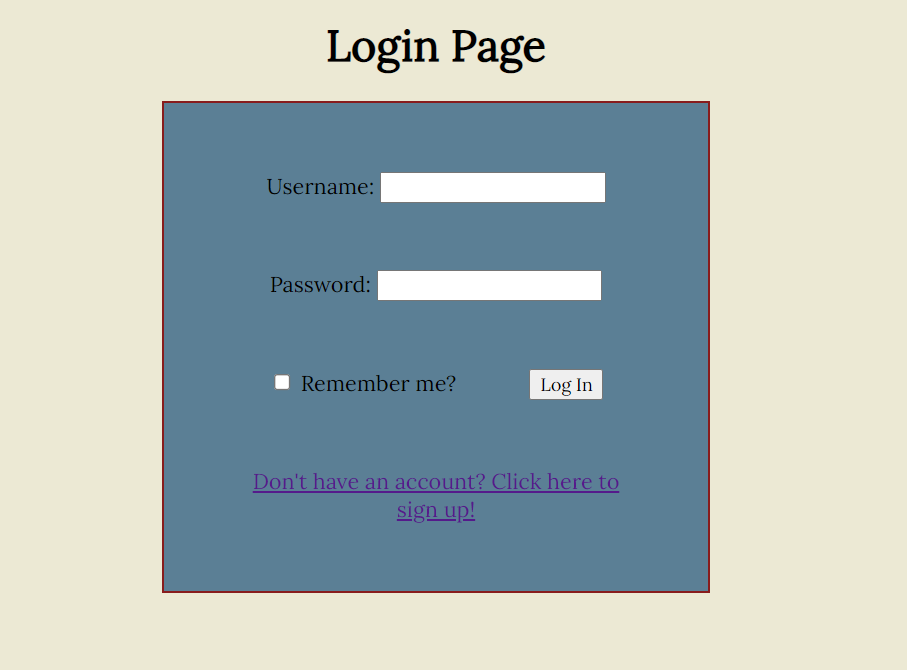
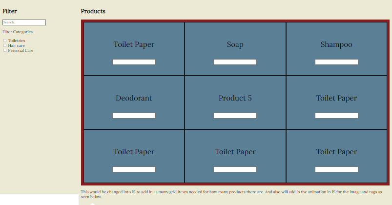

**Title: Clockwork**
---
**Subtitle: Kloseted supply**
---
**Semester: Spring 2022**
---

# Overview: 

> A brief overview of your application. This will be based on what you are submitting as your final web application artifact. You should also mention why your application is innovative.

We want to create an inventory tracker for the Student Care Supply Closets that is managed by the Dean of Students Office. The Student Care Supply Closets provides free toiletries and household items for students struggling economically. There is currently no way for students to know if they have the items they need in stock. So we want to create an inventory tracker that will let students know what is currently available. Additionally, we want to create a form for someone to ask how much they need for each item. 

# Team Members:

|No.          | Name      | Github Username |
| ----------- | ----------- | ----------- |
|1.           | Rajasi Desai      | Rajasi-Desai       |
|2.           | Grace Chang   | gracec4227        |
|3.           | Isi Bernoff   | isi-bernoff        |
|4.           | Aryan Mangalik   | amangalik       |


# User Interface: 
> A final up-to-date list/table describing your application’s user interface. This should include the name of the UI view and its purpose. You should include a screenshot of each of your UI views.

The following are the UI views of our application and a brief decription of them:

### Page to login
Used to log into our website.



### Sign up page
Used to register a new user/account if it does not exist. 


### Homepage with all information
Gives information about the UMass Supply Closet and an overview of the website


### Product page
It is the main page where a user can shop for the items in the Supply Closet.



### Product page with the drop down cart
The drop down cart shows the current items in the cart added by the user.


### Checkout page
Checkout page is used to "checkout" and submit a request for all the items a user has selected


### Map page to find locations
This page links Google Maps and points out to all the locations that provide free Menstural products.


# APIs: 
> A final up-to-date list/table describing your application’s API

# Database: 
> A final up-to-date representation of your database including a brief description of each of the entities in your data model and their relationships if any.

Database: supply

There are two collections within this database.

## Items

Items collection is used store the current inventory of the Supply Closet. 

Each Item in the database has:
- id - ID for the given item
- name - Name of the Item
- stock - Contains the current stock of the item
- description - Contains the description of the item
- tags - Contains the tags of the items. Used for filtering the products page
- image - Contiains the name of the image file that is used to display the item

```json
item document     
{    
    id: Integer,       
    name: String,  
    stock: Integer,  
    description: String,  
    tags: Array of Strings,  
    image: String  
}
```


## Users 

Users collection is used to store all the users of the website.

Each User in the database has:

- username - Contains the username of the user
- password - Contains the password for the user
- cart - Has the cart of the user
    -  Each cart consists of:
        - id - ID of the cart 
        - items - An array of all items in the cart of type Item along with the quantities of those items in the cart

```json
users document  
{
    username: String,
    password: String,
    cart: {
        id: Integer,
        items: [{
            item: Item, 
            quantity: Integer
            }]
    }
}
```

# URL Routes/Mappings: 
> A final up-to-date table of all the URL routes that your application supports and a short description of what those routes are used for. You should also indicate any authentication and permissions on those routes.

## User endpoints

### Login
1. `/user/register?username=<username>&password=<password>`: Register new user
2. `/user/login`: Login existing user
3. `/user/id/update?password=<new_password>`: Update user's password

### Cart
1. `/user/id/cart/add?item=<item_name>` : To add the item to the user's cart
2. `/user/id/cart/increment?item=<item_name>` : To increment the item in the user's cart
3. `/user/id/cart/decrement?item=<item_name>` : To decrement the item in the user's cart
4. `/user/id/cart/delete?item=<item_name>` : Completely removes an item from the user's cart
5. `/user/id/cart/empty` : Removes all items from the user's cart

### Checkout
1. `/user/id/checkout/view`: Allows user to view items and checkout
2. `/user/id/cart`: Allows user to view their cart


## Admin endpoints

### Item
1. `/item/id/view`: Allows for viewing a item which will self contain it's tag information, quantity, and description
2. `/item/id/update?quantity=<value>`: Allows to update an item's quantity
3. `/item/id/update?tag=<value>` : Allows to update the item's tags.
4. `/item/id/update?description=<value>`: Allows to update an item's description
5. `/item/create?name=<item_name>&quantity=<quantity>&tag=<tag_values>&description=<desc_value>`: Allows for creating an item for the database.
6. `/item/id/delete` : Deletes the item from the database


# Authentication/Authorization: 
> A final up-to-date description of how users are authenticated and any permissions for specific users (if any) that you used in your application. You should mention how they relate to which UI views are accessible.

# Division of Labor:

### Rajasi: 


### Grace: 


### Isi:


### Aryan:

# Conclusion: 
> A conclusion describing your team’s experience in working on this project. This should include what you learned through the design and implementation process, the difficulties you encountered, what your team would have liked to know before starting the project that would have helped you later, and any other technical hurdles that your team encountered.

# Link to the hosted application:

https://final-clockwork-326.herokuapp.com/

# Link to the Video:

