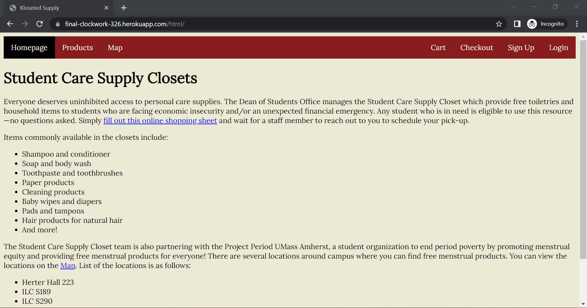
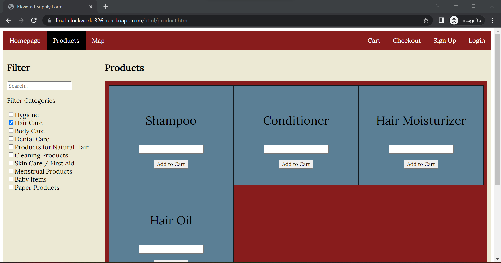
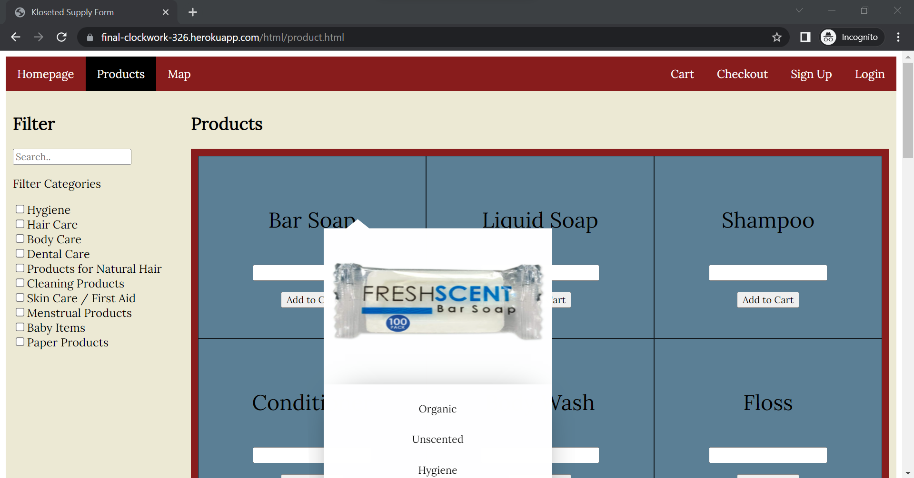
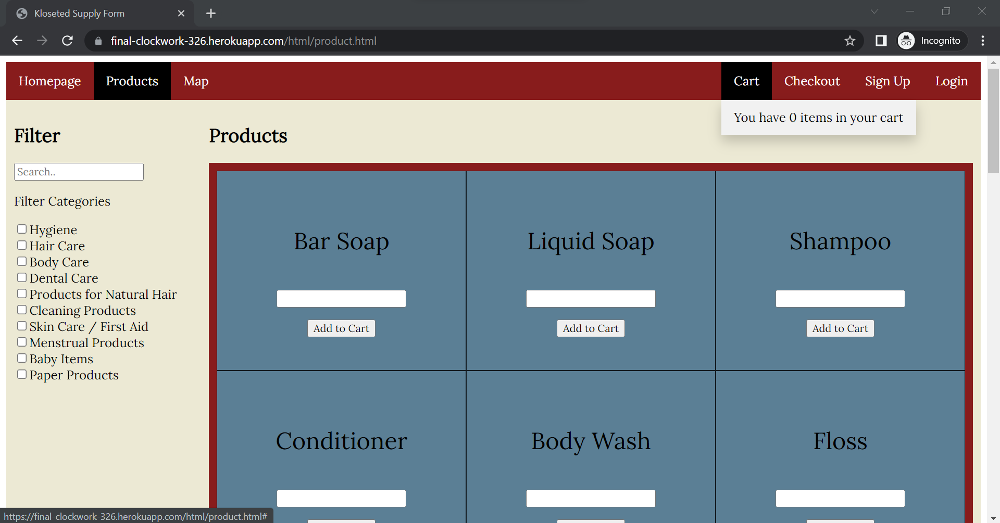
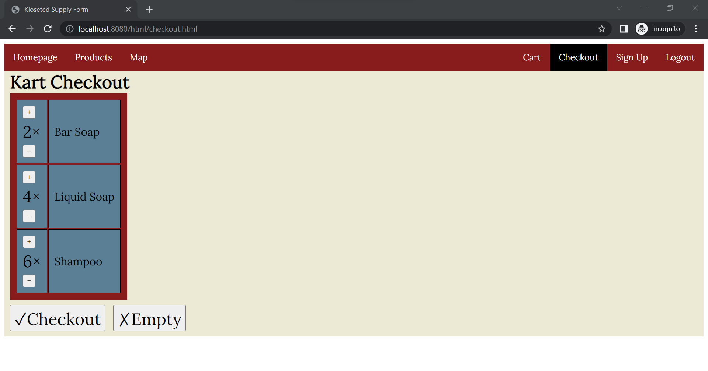
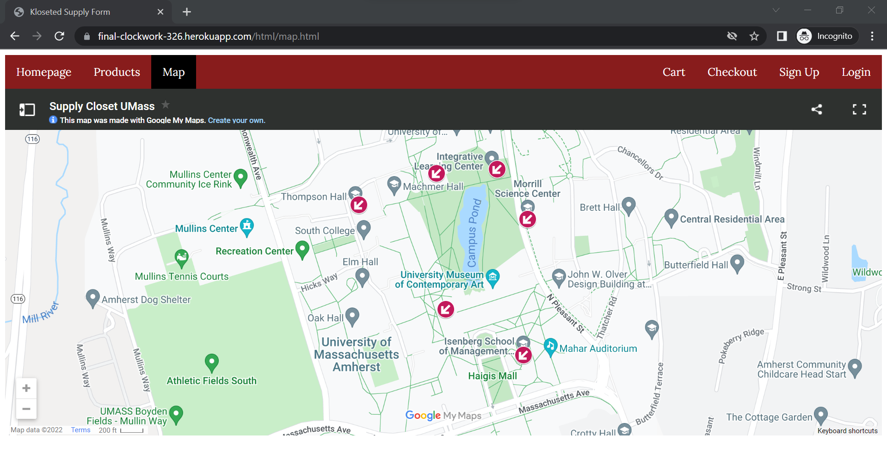

**Title: Clockwork**
---
**Subtitle: Kloseted supply**
---
**Semester: Spring 2022**
---  

# Overview:

We want to create an inventory tracker for the Student Care Supply Closets that is managed by the Dean of Students Office. The Student Care Supply Closets provides free toiletries and household items for students struggling economically. There is currently no way for students to know if they have the items they need in stock. So we want to create an inventory tracker that will let students know what is currently available. Additionally, we want to create a form for someone to ask how much they need for each item. 

Currently, the Supply Closet uses a Microsoft form to handle any requests. So, we wanted to automate this process for them to a certain degree and also make a user-friendly interface for people who are using this resource. The result is our website, Klosested Supply.

# Team Members:

|No.          | Name      | Github Username |
| ----------- | ----------- | ----------- |
|1.           | Rajasi Desai      | Rajasi-Desai       |
|2.           | Grace Chang   | gracec4227        |
|3.           | Isi Bernoff   | isi-bernoff        |
|4.           | Aryan Mangalik   | amangalik       |


# User Interface: 

The following are the UI views of our application and a brief decription of them:

### Page to login
Used to log into our website.


### Sign up page
Used to register a new user/account if it does not exist. 


### Homepage with all information
Gives information about the UMass Supply Closet and an overview of the website



### Product page
It is the main page where a user can shop for the items in the Supply Closet.


### Product page with filters
It is the main page where a user can shop for the items in the Supply Closet.



### Product page with Item drop down
It is the main page where a user can shop for the items in the Supply Closet.



### Product page with the drop down cart
The drop down cart shows the current items in the cart added by the user.



### Checkout page
Checkout page is used to "checkout" and submit a request for all the items a user has selected



### Map page to find locations
This page links Google Maps and points out to all the locations that provide free Menstural products.




# APIs: 

GET /getAllItems - gets all items in the database  
GET /private -   
GET /getUser?username=name - gets the user with the username=name  
GET /logout  
GET /getCart?username=name - gets the cart from the user with username=name  
POST /addItemCart?itemID=itemID&username=name - add item with itemID to the user's cart with username=name  
POST /incrementCartItem?itemID=itemID&username=name - increment the stock value of the item  


# Database

We implemented our database `supply` with MongoDB. It has two collections: `items` and `orders`.

## `items`

The `items` collection is used store the current inventory of Kloseted Supply.

Each `Item` document has the following format:
```json
{    
    id: Integer, //Item's identification number
    name: String, //Item's name
    stock: Integer, //Item's stock in inventory
    description: String, //Item's description
    tags: Array<String>,  //Item's tags
    image: String  //Filename of Item's image
}
```

## `users` 
The `users` collection is used to store all the users of the website.

Each `User` document has the following format:
```json
{
    name: String, //User's name
    password: String, //User's password
    cart: Array<Item> //User's cart
}
```

# URL Routes/Mappings

## User endpoints
- `/register`: Registers a new user and adds them to the database
- `/private`: Gets the username of the currently logged in user for database access
- `/login`: Authenticates the user and grants them access to the /private endpoint
- `/logout`: Logs out the user and removes their authentication
- `/getUser`: Returns the full user's object if they are logged in, or null

## Cart endpoints
For all cart endpoints, authentication of the user is required
- `/getCart`: Gets the user's cart
- `/addItemCart`: Adds the given item to the user's cart
- `/incrementItemCart`: Increments the quantity of the given item in the user's cart
- `/decrementItemCart`: Decrements the quantity of the given item in the user's cart
- `/deleteItem`: Deletes the given item from the user's cart
- `/emptyCart`: Deletes all items from the user's cart
- `/getCart`: Gets all the items from the cart

## Item
- `/getAllItems`: Gets all the list of items from the database.

# Authentication/Authorization:
Before logging in, the supply closet will display an empty checkout page to the client. It is only after logging in via the login page that the user gains authentication to view their information in the website. While logged in and authenticated, the user may access the contents of their cart via the checkout page since they now have access to the /private endpoint. All users have the same permissions, and may only access the contents of their own cart from their information stored in the database, and nothing else. Users may then log out via the logout button and they then lose authentication to access their cart until they log in again.

# Division of Labor

### Rajasi: 
For the first milestone, I made the Map page and the Header/Navigation bar for the website. I also added the Cart funtionality with the dropdown and worked on the markdown file. For the second milestone, I worked on the cart implementation and worked on mostly the server side setting up the endpoints. I also worked on deploying the site on Heroku and creating the markdown templates. For the third milestone, I worked on the markdown file and connected the database to Heroku by adding the config variables. I also helped rerouting a few routes and setting up the server. I also did the overall cleaning of the code and wrote the markdowns.

### Grace: 
For the first milestone, I made the product page (called 'form' on the site) which included the grid of products and a prototype of an image that will appear when hovering over a product word. Also made filter/search area to filter through the grid of items. For the second milestone, I worked on changing the product/form page into JS and mainly worked on additional features such as filtering the products and creating a pop out image for each product. For the third milestone, I helped make the database and server. I also worked on changing on how to get the data from a JSON to getting from a database. I made data and put it in the database and connected to MongoDB

### Isi: 
For the first milestone, I made the checkout page and helped with the general layout and CSS and of the website. For the second milestone, I standardized the custom datatypes for `User`s, `Cart`s, and `Item`s and implemented checkout functionality. For the third and final milestone, I implemented the `Database` class and its methods, connecting to the server endpoints. Implemented CRUD operations for the checkout page.

### Aryan: 
For the first milestone, I made the login page as well as the sign up page. For the second milestone, I implemented the login and signup pages using JS, allowing the user to both register a new account and log in to access their cart and make orders. I also edited each page to allow the user to log out from any page. For the third and final milestone, I implemented all of the authorization and CRUD operations for users logging in and registering. I also implemented and fixed server endpoints.


# Conclusion

This project was definitely a fun one to do but required a lot of effort. One of the major things we learned through this was team work and collaboration. All four of us were pair programming most of the time for this project using LiveShare in VScode. This allowed us to avoid any merge conflicts on Git and allowed us to work together as a team. 

Since we were learning things in class in a way that we had to change up things in a project again and again, it led to slight confusion and disorganization. But in the end we made things work and compatible.

We would have loved to know about authentication and database stuff beforehand beucause later it came to a point where we were rewriting a lot of the code to have it compatible with these things. 

# Link to the hosted application:

https://final-clockwork-326.herokuapp.com/

# Link to the Video:
upload to youtube

# Group Grading Rubric

## Frontend (HTML & CSS): 20 points
   * 5 points - Clean and crisp site organization (Overall CSS is consisten and looks good)
   * 5 points - Images are viewable on the 'Form Page' when hovering over an item's name
   * 10 points - UI works as intended (Can move to different pages)

## JS and Site Functionality: 30 points
   * 30 points - Users are able to view data
   * 5: Hover to see images and description of items
   * 5: Can filter the 'Form' page based off the tag
   * 10: Map is viewable and interactive
   * 10: Can sign up a user and login
## Database and Server: 25 points
   * 15: Data is fetched and displays products 
   * 10: Sends back data to the cart, keeps count and displays the count
## Authentication: 25 points
   * 10 points - Users are successfully able to log in and authenticate themselves
   * 10 points - Users are able to securely access their personal data via the UI while authenticated
   * 5 points - New users are able to sign up and register themselves in the database